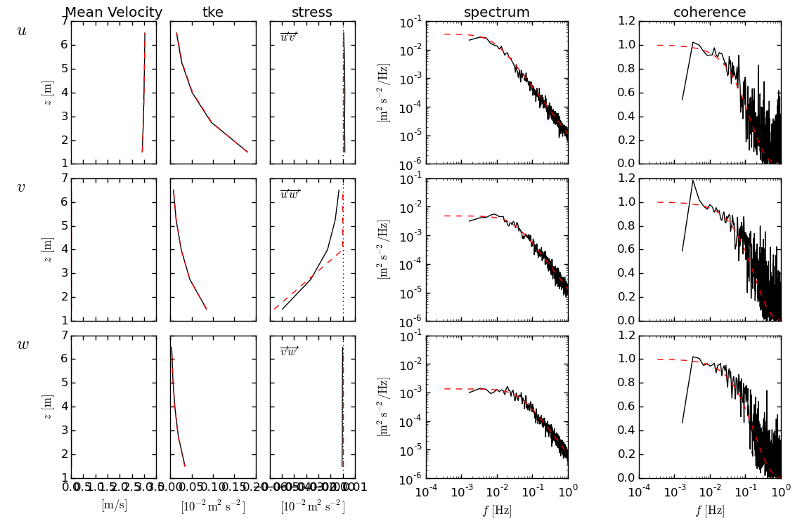

Plotting Tools
==============

|pyts| is equipped with a flexible set of plotting tools for plotting
|pyts| output and comparing it to target (input) statistics. For
example, the following code performs a |pyts| run and compares the
output (``out``) mean profile and spectrum with the targets specified
in the run (``tsr``).

.. plot:: examples/plotting.py
          :include-source:

The types of plots shown in the figure can be specified when
initializing the plotting object. For example if we change the
plotting object initialization to::
  fig = plt.new_summ_fig(axforms=[plt.velprof_axForm([0,3.5]),plt.tkeprof_axForm(),plt.stressprof_axForm(),plt.spec_axForm(),plt.cohere_axForm()])

Here we have used the PyTurbSim plotting 'axes forms' objects to specify the types of plots to make.  Here we have specified a velocity profile (with axes limits from 0 to 3.5), a tke profile, a stress profile, a spectral plot and a coherence plot. Leaving the rest of the code the same, will produce this plot:

